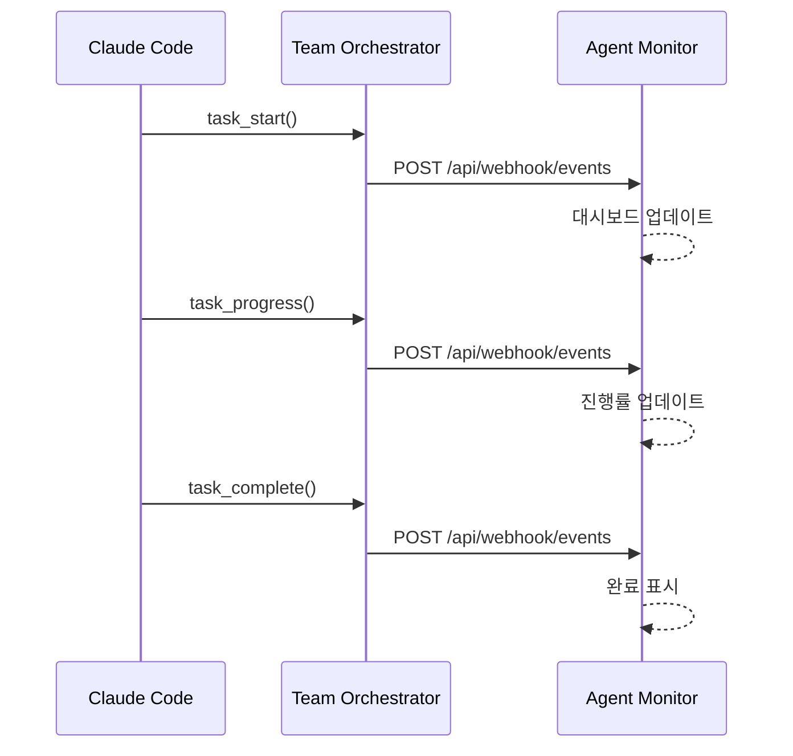

# 관련 프로젝트 가이드

## 개요

Claude Code 에코시스템을 구성하는 관련 프로젝트들입니다.

---

## 1. Serena MCP

### 소개
시맨틱 코드 분석 및 편집을 위한 MCP 서버입니다.

- **GitHub**: https://github.com/serena-ai/serena-mcp
- **용도**: 필수 - 코드 탐색, 심볼 분석, 리팩토링

### 설치
```json
{
  "mcpServers": {
    "serena": {
      "command": "uvx",
      "args": ["--from", "serena-mcp", "serena", "--project", "."]
    }
  }
}
```

### 주요 도구

| 도구 | 설명 |
|------|------|
| `find_symbol` | 심볼(클래스, 함수 등) 검색 |
| `get_symbols_overview` | 파일의 심볼 개요 조회 |
| `replace_symbol_body` | 심볼 본문 교체 |
| `find_referencing_symbols` | 심볼 참조 검색 |
| `search_for_pattern` | 패턴 검색 |
| `read_file` | 파일 읽기 |
| `list_dir` | 디렉토리 목록 |

### 사용 예시
```
// 클래스 찾기
find_symbol("UserService")

// 심볼 개요 보기
get_symbols_overview("src/services/auth.ts")

// 메서드 본문 교체
replace_symbol_body("UserService/login", "src/services/auth.ts", newBody)
```

---

## 2. Team Orchestrator MCP

### 소개
멀티 에이전트 팀 오케스트레이션을 위한 MCP 서버입니다.

- **GitHub**: https://github.com/tomtomjskim/team-orchestrator-mcp
- **용도**: 권장 - 팀 템플릿, 워크플로우, 에이전트 관리

### 설치
```json
{
  "mcpServers": {
    "team-orchestrator": {
      "command": "node",
      "args": ["/path/to/team-orchestrator-mcp/dist/index.js"]
    }
  }
}
```

### 핵심 기능

| 기능 | 설명 |
|------|------|
| **팀 템플릿** | web-dev, general, data-team, devops-team, design-team, content-team |
| **워크플로우 엔진** | DAG 기반 태스크 스케줄링, 병렬 실행 |
| **템플릿 레지스트리** | 원격 템플릿 검색, 다운로드, 캐싱 |
| **이벤트 발행** | SSE, Webhook, File, OTLP 지원 |

### 제공 템플릿

| 템플릿 | 에이전트 | 용도 |
|--------|---------|------|
| `web-dev` | PM, Explorer, Architect, Frontend, Backend, DevOps, QA, Documenter | 웹 서비스 개발 |
| `general` | PM, Explorer, Developer, Tester | 범용 프로젝트 |
| `data-team` | PM, Explorer, Data Engineer, ML Engineer, Analyst, DBA | 데이터/ML 프로젝트 |
| `devops-team` | PM, Explorer, Infra Engineer, CI/CD Engineer, Security Engineer, SRE | 인프라 관리 |
| `design-team` | PM, Explorer, UI Designer, UX Researcher, Design System, Prototyper | 디자인/UX 프로젝트 |
| `content-team` | PM, Explorer, Strategist, Writer, Editor, SEO Specialist | 콘텐츠/마케팅 |

### 주요 도구

#### Team Management
| 도구 | 설명 |
|------|------|
| `team_list_templates` | 사용 가능한 템플릿 목록 |
| `team_init` | 프로젝트에 팀 초기화 |
| `team_get_config` | 현재 팀 설정 조회 |
| `team_set_goal` | 프로젝트 목표 설정 |

#### Agent Management
| 도구 | 설명 |
|------|------|
| `agent_list` | 팀 에이전트 목록 |
| `agent_add` | 커스텀 에이전트 추가 |
| `agent_modify` | 에이전트 설정 수정 |

#### Workflow Management
| 도구 | 설명 |
|------|------|
| `workflow_list` | 워크플로우 목록 |
| `workflow_run` | 워크플로우 실행 |
| `workflow_status` | 실행 상태 조회 |

#### Task Events (Agent Monitor 연동)
| 도구 | 설명 |
|------|------|
| `task_start` | 태스크 시작 이벤트 |
| `task_progress` | 진행 상황 업데이트 |
| `task_complete` | 태스크 완료 |
| `task_fail` | 태스크 실패 |

#### Template Registry
| 도구 | 설명 |
|------|------|
| `registry_search` | 템플릿 검색 |
| `registry_download` | 템플릿 다운로드 |

### 사용 예시

```
// 팀 초기화
team_init({ template: "web-dev", projectPath: "/path/to/project" })

// 워크플로우 실행
workflow_run({ workflowId: "standard", input: { task: "로그인 구현" } })

// 태스크 이벤트 발행 (모니터 연동)
task_start({ agentId: "dev-1", agentType: "Developer", description: "API 구현" })
```

---

## 3. Agent Orchestra Monitor

### 소개
에이전트 활동을 실시간으로 모니터링하는 대시보드입니다.

- **GitHub**: https://github.com/tomtomjskim/agent-orchestra-monitor
- **용도**: 에이전트 활동 시각화, 태스크 추적, 이벤트 로그

### 주요 기능

| 기능 | 설명 |
|------|------|
| **실시간 대시보드** | 에이전트 상태, 태스크 진행 현황 |
| **태스크 추적** | 시작/진행/완료/실패 이벤트 |
| **이벤트 로그** | 전체 이벤트 히스토리 |
| **타임라인 뷰** | 에이전트 활동 타임라인 |

### 아키텍처

```
┌─────────────────┐      ┌─────────────────┐      ┌─────────────────┐
│  Team           │      │  Agent          │      │  Frontend       │
│  Orchestrator   │─────▶│  Orchestra      │─────▶│  Dashboard      │
│  MCP            │      │  Monitor        │      │                 │
│                 │      │  (Express)      │      │  (React)        │
│  - task_start   │      │                 │      │                 │
│  - task_progress│      │  - Webhook API  │      │  - 실시간 뷰    │
│  - task_complete│      │  - SSE Ingest   │      │  - 타임라인     │
│  - task_fail    │      │  - WebSocket    │      │  - 로그         │
└─────────────────┘      └─────────────────┘      └─────────────────┘
```

### 연동 방법

#### Webhook (권장)
```typescript
monitor_register({
  type: 'webhook',
  config: {
    url: 'http://localhost:4500/api/webhook/events'
  }
})
```

#### Docker 환경
```typescript
monitor_register({
  type: 'webhook',
  config: {
    url: 'http://agent-monitor:4500/api/webhook/events'
  }
})
```

### 이벤트 플로우



---

## 통합 설정 예시

### MCP 설정 (전체)
```json
{
  "mcpServers": {
    "serena": {
      "command": "uvx",
      "args": ["--from", "serena-mcp", "serena", "--project", "."]
    },
    "team-orchestrator": {
      "command": "node",
      "args": ["/path/to/team-orchestrator-mcp/dist/index.js"]
    }
  }
}
```

### Docker Compose (전체 스택)
```yaml
version: '3.8'
services:
  agent-monitor:
    image: agent-orchestra-monitor
    ports:
      - "4500:4500"
    environment:
      - NODE_ENV=production
```

### 워크플로우 예시

```
1. 프로젝트 시작
   └─ team_init({ template: "web-dev" })

2. 모니터 연동
   └─ monitor_register({ type: "webhook", config: { url: "..." } })

3. 작업 진행
   ├─ task_start({ agentType: "PM", description: "요구사항 분석" })
   ├─ task_progress({ progress: 50, message: "분석 중..." })
   └─ task_complete({ summary: "REQ-001 생성 완료" })

4. 대시보드 확인
   └─ http://localhost:4500
```

---

## 권장 구성

### 기본 (필수)
- Serena MCP

### 표준 (권장)
- Serena MCP
- Team Orchestrator MCP

### 전체 (팀 협업)
- Serena MCP
- Team Orchestrator MCP
- Agent Orchestra Monitor

---

## 참고 링크

- [Serena MCP 문서](https://github.com/serena-ai/serena-mcp)
- [Team Orchestrator MCP 문서](https://github.com/tomtomjskim/team-orchestrator-mcp)
- [Agent Orchestra Monitor 문서](https://github.com/tomtomjskim/agent-orchestra-monitor)
- [Claude Code 공식 문서](https://docs.anthropic.com/claude-code)
