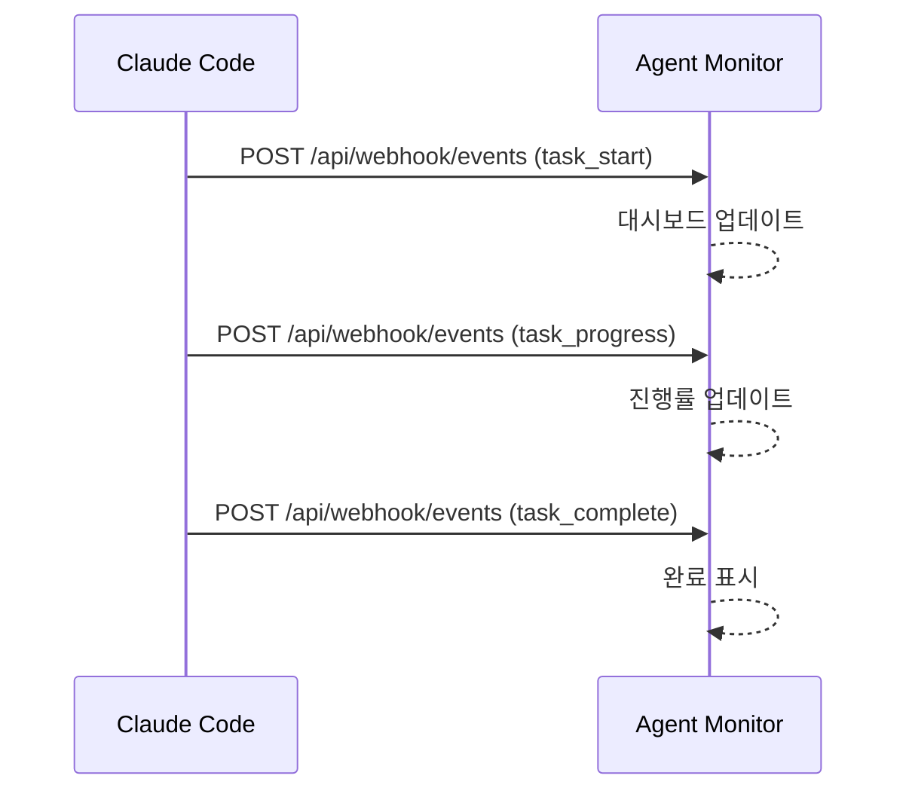

# 관련 프로젝트 가이드

## 개요

Claude Code 에코시스템을 구성하는 관련 프로젝트들입니다.

---

## 1. Serena MCP

### 소개
시맨틱 코드 분석 및 편집을 위한 MCP 서버입니다.

- **GitHub**: https://github.com/serena-ai/serena-mcp
- **용도**: 필수 - 코드 탐색, 심볼 분석, 리팩토링

### 설치
```json
{
  "mcpServers": {
    "serena": {
      "command": "uvx",
      "args": ["--from", "serena-mcp", "serena", "--project", "."]
    }
  }
}
```

### 주요 도구

| 도구 | 설명 |
|------|------|
| `find_symbol` | 심볼(클래스, 함수 등) 검색 |
| `get_symbols_overview` | 파일의 심볼 개요 조회 |
| `replace_symbol_body` | 심볼 본문 교체 |
| `find_referencing_symbols` | 심볼 참조 검색 |
| `search_for_pattern` | 패턴 검색 |
| `read_file` | 파일 읽기 |
| `list_dir` | 디렉토리 목록 |

### 사용 예시
```
// 클래스 찾기
find_symbol("UserService")

// 심볼 개요 보기
get_symbols_overview("src/services/auth.ts")

// 메서드 본문 교체
replace_symbol_body("UserService/login", "src/services/auth.ts", newBody)
```

---

## 2. Claude Code 네이티브 멀티 에이전트 (Team Orchestrator MCP 대체)

> **Team Orchestrator MCP는 deprecated 되었습니다.**
> Claude Code는 이제 멀티 에이전트 오케스트레이션을 네이티브로 지원합니다.
> 별도 MCP 서버 없이 아래 도구들을 직접 사용하세요.

### 네이티브 도구

| 도구 | 설명 | 사용 시점 |
|------|------|----------|
| `Task()` | 서브에이전트 스폰 및 실행 | 독립적인 작업 위임 |
| `Agent()` | 에이전트 실행 | 단일 에이전트 작업 |
| `TeamCreate()` | 에이전트 팀 생성 | 복잡한 멀티 에이전트 협업 |
| `SendMessage()` | 에이전트 간 메시지 전달 | 에이전트 통신 |

### 사용 예시

```
// 단일 서브에이전트 실행
Task("백엔드 API 구현", { persona: "Developer" })

// 병렬 에이전트 실행
Task("프론트엔드 구현", { persona: "Frontend" })
Task("백엔드 구현", { persona: "Backend" })

// 팀 생성 후 메시지 전달
TeamCreate([{ role: "PM" }, { role: "Developer" }, { role: "QA" }])
SendMessage("PM", "로그인 기능 구현 시작")
```

### 기존 Team Orchestrator MCP와의 차이

| 항목 | Team Orchestrator MCP | Claude Code 네이티브 |
|------|----------------------|---------------------|
| 설치 | 별도 Node.js 서버 | 내장 (설치 불필요) |
| 팀 템플릿 | web-dev, general 등 사전 정의 | CLAUDE.md 페르소나로 자유 정의 |
| 워크플로우 엔진 | DAG 기반 YAML | 커스텀 커맨드 + 스킬 |
| 이벤트 발행 | SSE/Webhook → Agent Monitor | 직접 연동 가능 |

---

## 3. Agent Orchestra Monitor

### 소개
에이전트 활동을 실시간으로 모니터링하는 대시보드입니다.

- **GitHub**: https://github.com/tomtomjskim/agent-orchestra-monitor
- **용도**: 에이전트 활동 시각화, 태스크 추적, 이벤트 로그

### 주요 기능

| 기능 | 설명 |
|------|------|
| **실시간 대시보드** | 에이전트 상태, 태스크 진행 현황 |
| **태스크 추적** | 시작/진행/완료/실패 이벤트 |
| **이벤트 로그** | 전체 이벤트 히스토리 |
| **타임라인 뷰** | 에이전트 활동 타임라인 |

### 아키텍처

```
┌─────────────────┐      ┌─────────────────┐      ┌─────────────────┐
│  Claude Code    │      │  Agent          │      │  Frontend       │
│  Native Tools   │─────▶│  Orchestra      │─────▶│  Dashboard      │
│                 │      │  Monitor        │      │                 │
│  - Task()       │      │  (Express)      │      │  (React)        │
│  - Agent()      │      │                 │      │                 │
│  - TeamCreate() │      │  - Webhook API  │      │  - 실시간 뷰    │
│  - SendMessage()│      │  - SSE Ingest   │      │  - 타임라인     │
│                 │      │  - WebSocket    │      │  - 로그         │
└─────────────────┘      └─────────────────┘      └─────────────────┘
```

### 연동 방법

#### Webhook (권장)
```typescript
monitor_register({
  type: 'webhook',
  config: {
    url: 'http://localhost:4500/api/webhook/events'
  }
})
```

#### Docker 환경
```typescript
monitor_register({
  type: 'webhook',
  config: {
    url: 'http://agent-monitor:4500/api/webhook/events'
  }
})
```

### 이벤트 플로우



---

## 4. Hermes Agent Desktop / Office Web UI

### 소개

Hermes Agent Desktop은 Hermes gateway, SSH/Tailscale remote runtime, Office
Web UI를 하나의 desktop shell에서 다루는 작업 표면입니다. Office/Claw3D는
브라우저로 직접 접근할 수도 있고 Electron webview 안에서 임베드될 수도
있으므로, 두 경로의 실패 원인을 분리해서 봐야 합니다.

### 운영 포인트

| 항목 | 기준 |
|------|------|
| Gateway | remote Hermes gateway는 `/health`로 확인 |
| Remote 연결 | Tailscale + SSH tunnel을 우선 사용 |
| Office URL | app webview는 root redirect 대신 `/office` 직접 로드 |
| Adapter | SSH mode에서는 `HERMES_API_URL`을 local tunnel URL로 주입 |
| Secret | API key 원문은 문서화하지 않고 config/env로만 전달 |
| Debug | CDP 포트는 임시 검증용으로만 열고 종료 후 닫기 |

### 브라우저 정상 / 앱 blank 구분

| 현상 | 우선 의심 |
|------|----------|
| `http://localhost:3000/office`는 정상 | Office server 자체는 살아 있음 |
| Electron app만 blank | webview lifecycle, hidden tab size, load event 문제 |
| `Loading Claw3D...` 지속 | webview event listener 또는 readiness race |
| `chrome-error://chromewebdata` | webview가 dev server 준비 전에 먼저 붙음 |

상세 기준은 [Agent Tools And Hermes Web UI](36-agent-tools-and-hermes-web-ui.md)를
따릅니다.

---

## 통합 설정 예시

### MCP 설정 (전체)
```json
{
  "mcpServers": {
    "serena": {
      "command": "uvx",
      "args": ["--from", "serena-mcp", "serena", "--project", "."]
    }
  }
}
```

### Docker Compose (전체 스택)
```yaml
version: '3.8'
services:
  agent-monitor:
    image: agent-orchestra-monitor
    ports:
      - "4500:4500"
    environment:
      - NODE_ENV=production
```

### 워크플로우 예시

```
1. 프로젝트 시작
   └─ team_init({ template: "web-dev" })

2. 모니터 연동
   └─ monitor_register({ type: "webhook", config: { url: "..." } })

3. 작업 진행
   ├─ task_start({ agentType: "PM", description: "요구사항 분석" })
   ├─ task_progress({ progress: 50, message: "분석 중..." })
   └─ task_complete({ summary: "REQ-001 생성 완료" })

4. 대시보드 확인
   └─ http://localhost:4500
```

---

## 권장 구성

### 기본 (필수)
- Serena MCP

### 표준 (권장)
- Serena MCP
- Claude Code 네이티브 멀티 에이전트 (Task, Agent, TeamCreate, SendMessage)

### 전체 (팀 협업 모니터링)
- Serena MCP
- Claude Code 네이티브 멀티 에이전트
- Agent Orchestra Monitor
- Hermes Agent Desktop / Office Web UI

---

## 참고 링크

- [Serena MCP 문서](https://github.com/serena-ai/serena-mcp)
- [Agent Orchestra Monitor 문서](https://github.com/tomtomjskim/agent-orchestra-monitor)
- [Agent Tools And Hermes Web UI](36-agent-tools-and-hermes-web-ui.md)
- [Claude Code 공식 문서](https://docs.anthropic.com/claude-code)
