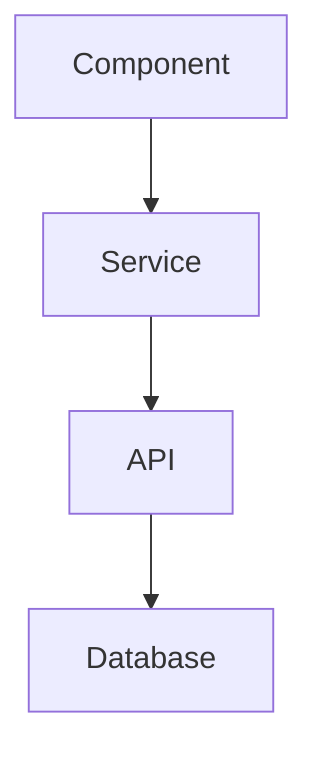
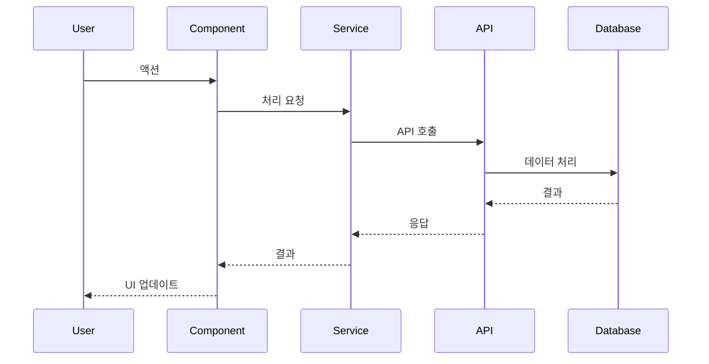

# DONE-XXX: [기능명]

## 메타데이터
| 항목 | 내용 |
|------|------|
| ID | DONE-XXX |
| 관련 요구사항 | REQ-XXX |
| 관련 태스크 | TASK-XXX, TASK-XXX |
| 완료일 | YYYY-MM-DD |
| 담당자 | - |

---

## 1. 요약

### 1.1 구현 내용
[구현된 기능에 대한 간략한 요약]

### 1.2 주요 변경사항
- [변경사항 1]
- [변경사항 2]
- [변경사항 3]

---

## 2. 구현 상세

### 2.1 구현된 기능
| 기능 | 상태 | 비고 |
|------|------|------|
| 기능 1 | ✅ 완료 | |
| 기능 2 | ✅ 완료 | |
| 기능 3 | ⚠️ 일부 | [미완료 사유] |

### 2.2 API 엔드포인트
| Method | Path | 설명 |
|--------|------|------|
| GET | /api/resource | 목록 조회 |
| POST | /api/resource | 생성 |

### 2.3 주요 컴포넌트/파일
| 파일 | 역할 |
|------|------|
| src/path/Component.tsx | [역할] |
| src/services/service.ts | [역할] |

---

## 3. 아키텍처

### 3.1 구조 다이어그램


### 3.2 데이터 흐름


---

## 4. 테스트 결과

### 4.1 테스트 커버리지
| 분류 | 커버리지 | 테스트 수 |
|------|----------|----------|
| 단위 테스트 | XX% | X개 |
| 통합 테스트 | XX% | X개 |
| E2E 테스트 | - | X개 |

### 4.2 테스트 케이스
- [x] 정상 케이스: [설명]
- [x] 예외 케이스: [설명]
- [x] 경계 케이스: [설명]

---

## 5. 알려진 이슈 및 제한사항

### 5.1 알려진 이슈
| 이슈 | 심각도 | 상태 | 비고 |
|------|--------|------|------|
| [이슈] | Low | 추후 개선 | [설명] |

### 5.2 제한사항
- [제한사항 1]
- [제한사항 2]

### 5.3 기술 부채
- [ ] [개선 필요 사항]

---

## 6. 향후 개선사항
- [ ] [개선사항 1]
- [ ] [개선사항 2]
- [ ] [개선사항 3]

---

## 7. 사용 방법

### 7.1 기본 사용법
```typescript
// 사용 예시 (최소한의 코드)
```

### 7.2 설정 옵션
| 옵션 | 타입 | 기본값 | 설명 |
|------|------|--------|------|
| option1 | string | 'default' | [설명] |

---

## 8. 관련 문서
- [요구사항](../requires/REQ-XXX.md)
- [설계 문서](../spec/architecture/feature.md)
- [API 문서](../spec/api/feature-api.md)

---

## 변경 이력
| 날짜 | 버전 | 내용 |
|------|------|------|
| YYYY-MM-DD | 1.0 | 초기 릴리스 |
