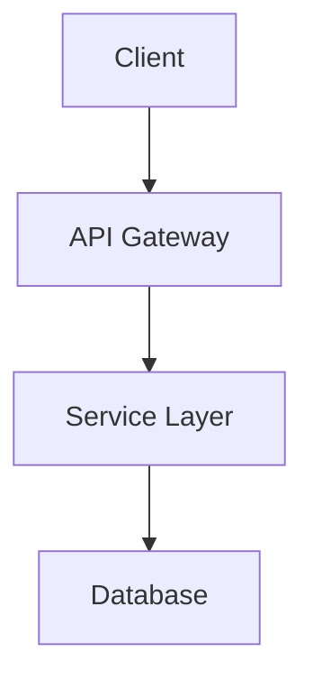
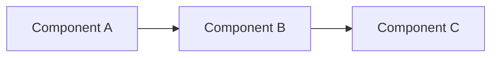
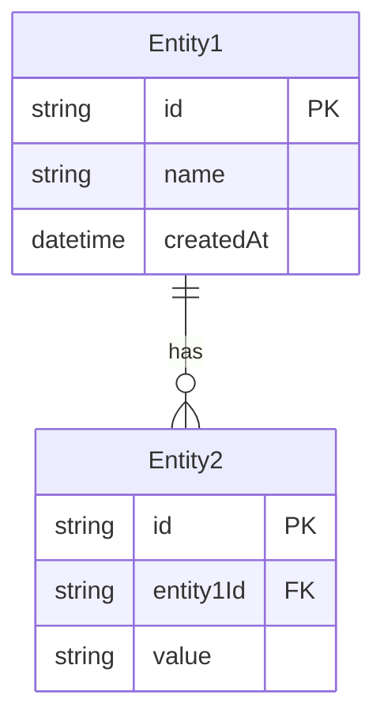
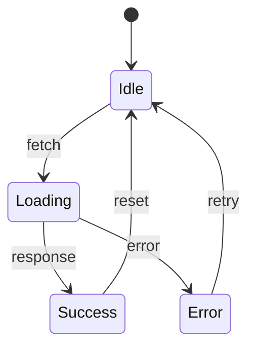

# [기능명] 설계 문서

## 메타데이터
| 항목 | 내용 |
|------|------|
| 관련 요구사항 | REQ-XXX |
| 작성일 | YYYY-MM-DD |
| 상태 | Draft / Review / Approved |
| 담당자 | - |

---

## 1. 개요

### 1.1 목적
[설계 문서의 목적]

### 1.2 범위
[설계 범위 - 포함/제외 항목]

---

## 2. 아키텍처

### 2.1 시스템 구조


### 2.2 컴포넌트 구조


---

## 3. 데이터 모델

### 3.1 엔티티 정의


### 3.2 타입/인터페이스 정의
```typescript
interface Entity1 {
  id: string;
  name: string;
  createdAt: Date;
}

interface Entity2 {
  id: string;
  entity1Id: string;
  value: string;
}
```

---

## 4. API 설계

### 4.1 엔드포인트 목록
| Method | Path | 설명 |
|--------|------|------|
| GET | /api/resource | 목록 조회 |
| GET | /api/resource/:id | 상세 조회 |
| POST | /api/resource | 생성 |
| PATCH | /api/resource/:id | 수정 |
| DELETE | /api/resource/:id | 삭제 |

### 4.2 요청/응답 형식

#### GET /api/resource
**Response:**
```typescript
interface GetResourceResponse {
  success: true;
  data: Resource[];
  pagination: {
    page: number;
    limit: number;
    total: number;
  };
}
```

#### POST /api/resource
**Request:**
```typescript
interface CreateResourceRequest {
  name: string;
  description?: string;
}
```

**Response:**
```typescript
interface CreateResourceResponse {
  success: true;
  data: Resource;
}
```

---

## 5. UI 설계 (해당 시)

### 5.1 화면 구조
```
┌─────────────────────────────────────┐
│ Header                              │
├─────────────────────────────────────┤
│ ┌─────────┐  ┌───────────────────┐ │
│ │ Sidebar │  │                   │ │
│ │         │  │   Main Content    │ │
│ │         │  │                   │ │
│ └─────────┘  └───────────────────┘ │
├─────────────────────────────────────┤
│ Footer                              │
└─────────────────────────────────────┘
```

### 5.2 컴포넌트 계층
```
Page
├── Layout
│   ├── Header
│   ├── Sidebar
│   └── MainContent
│       ├── FeatureComponent
│       │   ├── SubComponent1
│       │   └── SubComponent2
│       └── AnotherFeature
└── Footer
```

---

## 6. 상태 관리

### 6.1 상태 구조
```typescript
interface FeatureState {
  data: Resource[];
  loading: boolean;
  error: string | null;
  selectedId: string | null;
}
```

### 6.2 상태 흐름


---

## 7. 에러 처리

### 7.1 에러 코드
| 코드 | 메시지 | 처리 방법 |
|------|--------|----------|
| E001 | Not Found | 404 페이지 표시 |
| E002 | Validation Error | 필드 에러 표시 |
| E003 | Server Error | 재시도 안내 |

### 7.2 에러 응답 형식
```typescript
interface ErrorResponse {
  success: false;
  error: {
    code: string;
    message: string;
    details?: Record<string, string>;
  };
}
```

---

## 8. 보안 고려사항
- [ ] 인증/인가 확인
- [ ] 입력 값 검증
- [ ] XSS 방지
- [ ] CSRF 방지
- [ ] SQL Injection 방지

---

## 9. 성능 고려사항
- [ ] 쿼리 최적화
- [ ] 캐싱 전략
- [ ] 페이지네이션
- [ ] 로딩 상태 처리

---

## 10. 테스트 계획

### 10.1 단위 테스트
- [ ] 서비스 로직 테스트
- [ ] 유틸리티 함수 테스트

### 10.2 통합 테스트
- [ ] API 엔드포인트 테스트
- [ ] 컴포넌트 통합 테스트

### 10.3 E2E 테스트
- [ ] 주요 사용자 시나리오

---

## 변경 이력
| 날짜 | 버전 | 변경 내용 | 작성자 |
|------|------|----------|--------|
| YYYY-MM-DD | 1.0 | 초안 작성 | - |
